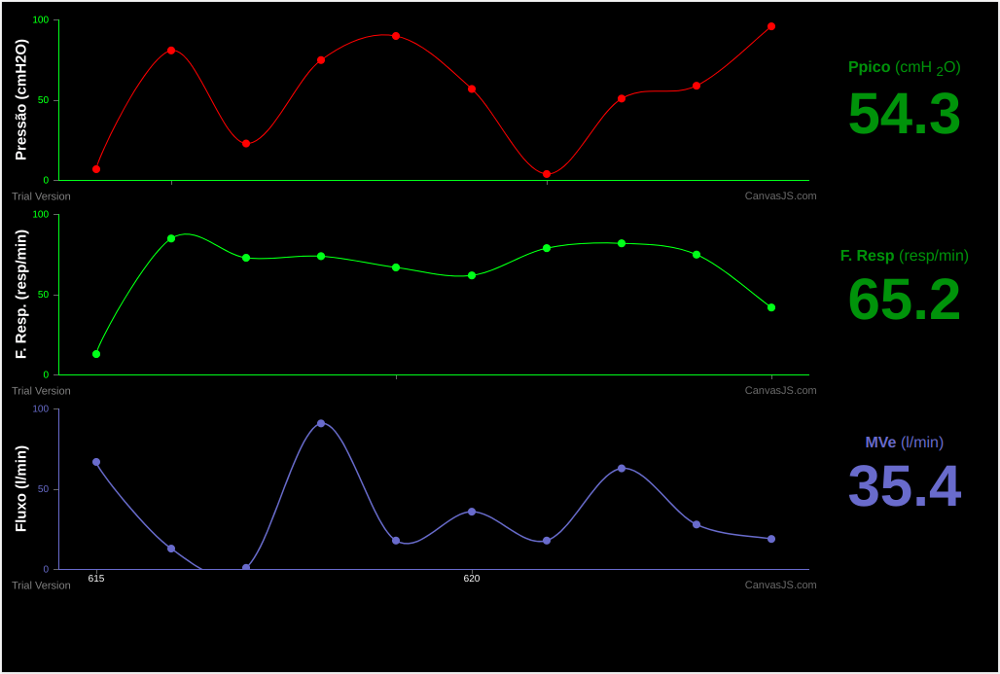

# Respiral

<h1>Objetivo</h1>

O projeto Respiral é uma iniciativa de pesquisadores, professores, engenheiros e estudantes para ajudar na atual 
pandemia pela qual estamos passando.

Para ajudar nessa contribuição, este respositório tem como fim torna público o código que será implementado para 
criar o "monitor" do projeto.

Abaixo segue uma foto do estado atual do monitor onde todos os dados estão sendo gerados pelo próprio JavaScript, somente
para fim de demostração.

# Observações

 Somos um grupo de pesquisadores focados na criação de um respirador mecânico de baixo custo, 
com o intuito de auxiliar no tratamento da Covid19.

 Este projeto vai além da área de informática. Temos engenheiros no desenvolvimento da mecânico do projeto e pessoas 
capacidades que estão nos ajudando a buscar recursos. 

Se você deseja nos ajudar pode  
<a href="https://www.vakinha.com.br/vaquinha/respiral-respirador-pulmonar?utm_campaign=new_contribution_whatsapp&utm_content=976125&utm_medium=email&utm_source=VKTransacional">clicar aqui</a> 
para contribuir na nosso vakinha ;).

Siga também nossa página no instagram <a href="https://www.instagram.com/projeto.respiral/"> clicando aqui</a>
ou pesquise por @projeto.respiral

#Mídia

<a href = "https://g1.globo.com/al/alagoas/video/teste-mostra-respiral-20-funcionando-equipamento-foi-criado-por-pesquisadores-de-al-8638869.ghtml"> 
Saímos no G1
</a>
<a href = "https://www2.ifal.edu.br/noticias/respirador-mecanico-de-baixo-custo-e-produzido-com-ajuda-de-professor-e-estudante-do-ifal">
Teve uma publicação da minha instituição
</a>

 Além dessas duas postagem, saímos em diversos outros jornais e blogs.

 Para sabe mais sobre o projeto basta pesquisar por "Projeto respiral" no Google

